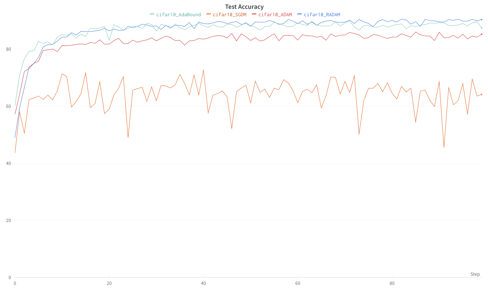

Benchmark Suite for Stochastic Gradient Descent Optimization Algorithms in Pytorch
-----

Credits https://github.com/ifeherva/optimizer-benchmark for the underlying framework.

We want to analyze the performance of various optimizers based on Stochastic Gradient Descent algorithms against the
problem of image classification problems. We have benchmarked using a ResNet18 network trained and evaluated on CIFAR10
dataset.

Analyzed optimizers:

1. Stochastic Gradient Descent with Momentum (SGDM)
1. Adam: A method for stochastic optimization (ADAM)
1. RAdam: On the Variance of the Adaptive Learning Rate and Beyond
1. AdaBound: Adaptive Gradient Methods with Dynamic Bound of Learning Rate

Results:
------

TBD




Citations for optimizers:
------

```
@article{liu2020improved,
  title={An improved analysis of stochastic gradient descent with momentum},
  author={Liu, Yanli and Gao, Yuan and Yin, Wotao},
  journal={arXiv preprint arXiv:2007.07989},
  year={2020}
}

@article{kingma2014adam,
  title={Adam: A method for stochastic optimization},
  author={Kingma, Diederik P and Ba, Jimmy},
  journal={arXiv preprint arXiv:1412.6980},
  year={2014}
}

@article{liu2019variance,
  title={On the variance of the adaptive learning rate and beyond},
  author={Liu, Liyuan and Jiang, Haoming and He, Pengcheng and Chen, Weizhu and Liu, Xiaodong and Gao, Jianfeng and Han, Jiawei},
  journal={arXiv preprint arXiv:1908.03265},
  year={2019}
}

@article{luo2019adaptive,
  title={Adaptive gradient methods with dynamic bound of learning rate},
  author={Luo, Liangchen and Xiong, Yuanhao and Liu, Yan and Sun, Xu},
  journal={arXiv preprint arXiv:1902.09843},
  year={2019}
}
```